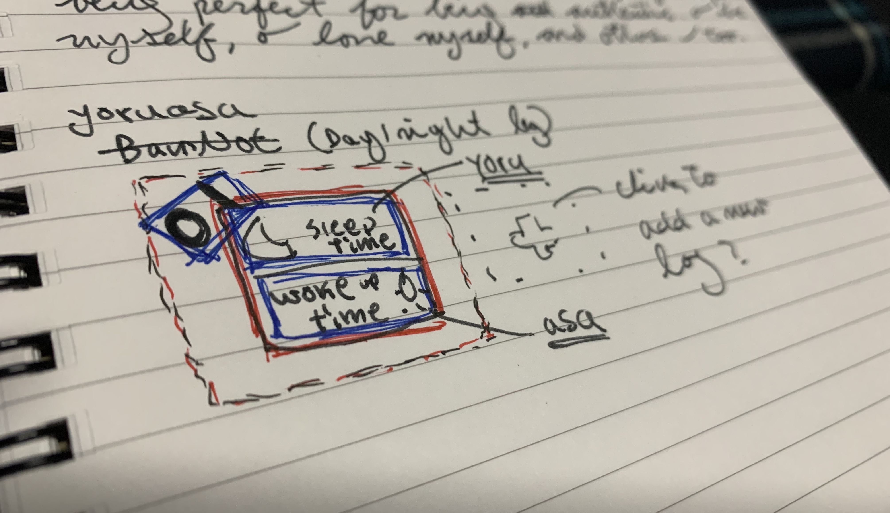
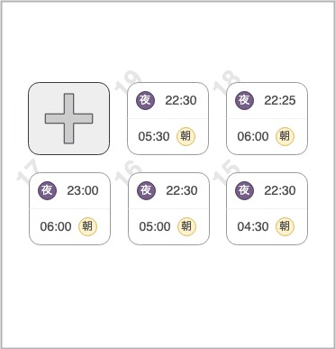
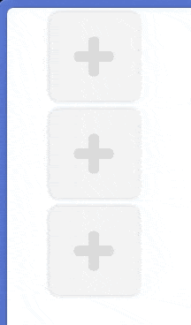
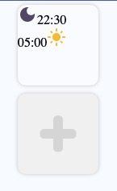

# YoruAsa (夜朝)

Bedtime and Wake Up Time Tracker.

## Progress

First draft of Yoruasa project. <br />


And this is the basic layout that I'm thinking of. <br />


### 2022.09.19

I implemented the `newRecord` button. <br />


### 2022.09.20

In process of implementing a recorded log. <br />


Material icon is used.

```jsx
import DarkModeIcon from '@mui/icons-material/DarkMode';
import LightModeIcon from '@mui/icons-material/LightMode';
```
